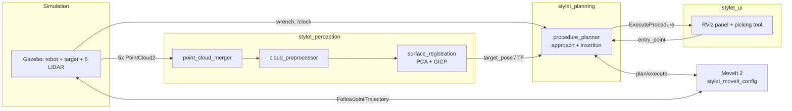

# Stylet

A ROS 2 simulation of **image-guided robotic needle insertion**: a UR5e arm locates a surgical target purely from LiDAR point clouds, then autonomously approaches and inserts a needle into it, with force-triggered replanning along the way.

Built as a portfolio project to demonstrate applied robotics engineering: perception (LiDAR fusion + ICP/GICP registration), motion planning (MoveIt 2), a from-scratch design pivot when the original plan hit a real physical constraint, and end-to-end system integration in simulation (Gazebo Harmonic).

For the full technical write-up - design decisions, what was tried and abandoned, validation methodology, known limitations - see **[ARCHITECTURE.md](ARCHITECTURE.md)**.

## Results

| Stage | Metric | Result |
|---|---|---|
| Target localization (5 LiDAR → GICP registration) | Translation / rotation error | **~0.015mm / ~0°**, 50/50 successful registrations |
| Approach (MoveIt planning to a pose oriented on the entry→target axis) | Position / alignment error | **0.86–2.5mm / <0.4°** |
| Needle insertion (force-monitored, prismatic actuator) | Position / alignment error | **0.76–1.62mm / 0.03–0.4°**, up to 245mm of insertion depth, single-attempt success in every recorded test |

A recorded demo (video + `ros2 bag`, 2026-07-09) covers the full pipeline: LiDAR scan → registration converges → operator picks an entry point in RViz → the arm approaches and inserts → live metrics in the panel.

## Quickstart

```bash
# from the workspace root, after `colcon build` and sourcing install/setup.bash
ros2 launch stylet_bringup full_demo.launch.py
```

Starts Gazebo, the full perception pipeline, MoveIt, and RViz (with the custom panel pre-loaded) in one command. Once the target's estimated pose has converged, click **"Set entry point"** and pick a point on the target in the 3D view, then click **"Launch operation"**.

## Architecture



`stylet_bringup` launches all of the above with the correct startup order/timing in one command.

## Packages

| Package | Role |
|---|---|
| [`stylet_description`](src/stylet_description) | URDF/xacro robot model (UR5e + custom needle-insertion actuator) |
| [`stylet_simulation`](src/stylet_simulation) | Gazebo world, target object, sensor bridges, controller spawning |
| [`stylet_perception`](src/stylet_perception) | LiDAR fusion, filtering, GICP surface registration |
| [`stylet_moveit_config`](src/stylet_moveit_config) | MoveIt 2 configuration (SRDF, kinematics, controllers) |
| [`stylet_planning`](src/stylet_planning) | The procedure planner: approach + force-monitored insertion |
| [`stylet_ui`](src/stylet_ui) | RViz panel and 3D entry-point picking tool |
| [`stylet_msgs`](src/stylet_msgs) | Custom `ExecuteProcedure` action |
| [`stylet_haptics`](src/stylet_haptics) | Phase 4 placeholder (simulated tissue haptics - not yet implemented) |
| [`stylet_bringup`](src/stylet_bringup) | Single-launch entry point for the full demo |

## Tech stack

ROS 2 Jazzy Jalisco · Gazebo Harmonic (`gz_ros2_control`) · MoveIt 2 · PCL (GICP registration) · Eigen · Qt 5 (RViz panel) · C++17 / Python 3

## Roadmap

- [x] **Phase 0** — Environment & ROS 2 fundamentals
- [x] **Phase 1** — URDF modeling of the robot and scene
- [x] **Phase 2** — LiDAR perception & surface registration
- [x] **Phase 3** — Motion planning & gesture execution (approach, prismatic insertion actuator, RViz UI, full-demo bringup)
- [ ] **Phase 4** — Simulated haptic feedback (layered spring-damper tissue model)
- [ ] **Phase 5** — Deformable/moving target (respiratory motion simulation)
- [ ] **Phase 6** — Finalization: tests, CI, demo materials

See [ARCHITECTURE.md](ARCHITECTURE.md) for the detailed design history behind each completed phase.
